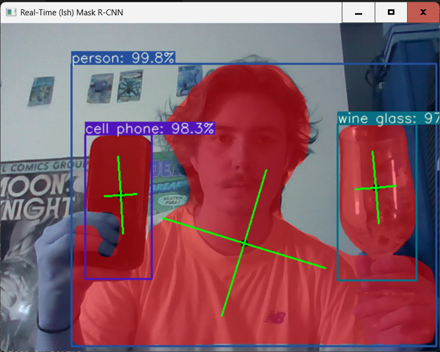
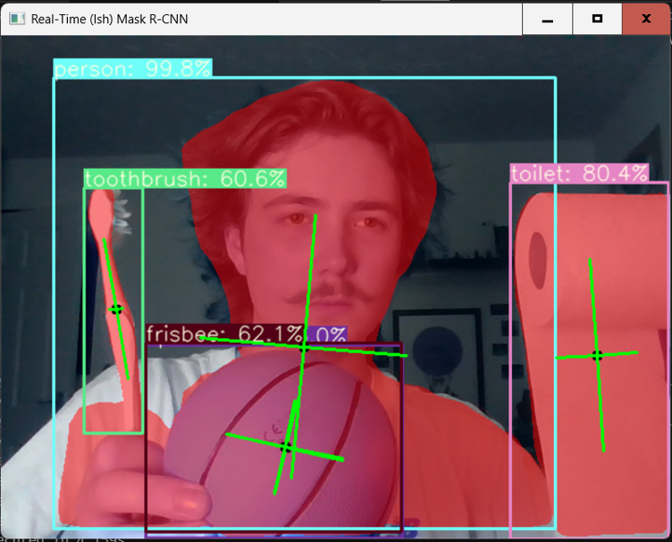

# Real-Time-Object-Detection-and-Instance-Segmentation
Overview:
This project is a real-time computer vision application, performing object detection and instance segmentation using a user's webcam feed. The system then uses Mask R-CNN to identify objects, generate bounding boxes, and then segmentation masks are created around detected instances.

This application demonstrates actual practical applicationjs of deep learning, as well as computer vision in real-time image processing.

Features:
- Real-time webcam capture
- Object detection
- Bounding box generation
- Instance segmentation masks
- Recognition of multiple objects in one frame
- Live detection visualisation

Technologies Used:
- Python
- Mask R-CNN
- Numpy 

Screenshots:

Phone and Human Recognition:

Multiple Object Detection:

How to Run:
Install dependencies: 'pip install -r requirements.txt'
Open the notebook: 'objectAndInstance.ipynb'
Run the cell to begin the program.

Author:
- Developed by Benjamin Kay as part of a university assignment.
